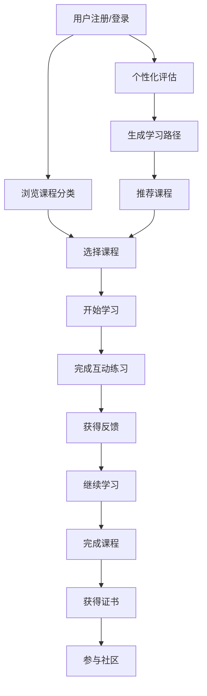

## 1. Product Overview
商务数据分析学习在线教育平台，为用户提供沉浸式的语言学习体验和专业的数据分析技能培训。
- 主要面向需要提升商务数据分析能力的职场人士和学生，解决数据技能学习的碎片化和缺乏系统化指导的问题。
- 产品价值在于提供专业、系统的商务数据分析课程体系，帮助用户快速掌握实用技能并应用到实际工作中。

## 2. Core Features

### 2.1 User Roles
| 角色 | 注册方式 | 核心权限 |
|------|---------------------|------------------|
| 普通用户 | 邮箱注册 | 浏览课程、学习内容、参与社区 |
| 高级用户 | 付费升级 | 访问所有高级课程、下载学习资料、获得专属学习路径 |

### 2.2 Feature Module
1. **首页**: 英雄区、课程分类导航、推荐课程、学习进度概览
2. **课程页**: 课程详情、章节内容、互动练习、学习进度
3. **个人中心**: 学习档案、成就系统、个性化推荐、设置
4. **社区页**: 讨论区、问答板块、用户分享、专家答疑
5. **登录/注册页**: 用户认证、密码找回、第三方登录

### 2.3 Page Details
| 页面名称 | 模块名称 | 功能描述 |
|-----------|-------------|---------------------|
| 首页 | 英雄区 | 展示平台核心价值，自动轮播学习成果案例，引导用户注册 |
| 首页 | 课程分类导航 | 按难度级别和主题分类展示课程，支持筛选和搜索 |
| 首页 | 推荐课程 | 根据用户兴趣和学习历史推荐相关课程 |
| 首页 | 学习进度概览 | 显示当前学习的课程进度，快速访问最近学习内容 |
| 课程页 | 课程详情 | 展示课程简介、讲师信息、课程大纲、用户评价 |
| 课程页 | 章节内容 | 视频教程、文字讲解、代码示例、案例分析 |
| 课程页 | 互动练习 | 实时数据操作练习、案例分析任务、 quizzes |
| 课程页 | 学习进度 | 记录学习时长、完成状态、成绩统计 |
| 个人中心 | 学习档案 | 查看所有课程的学习记录、获得的证书、技能图谱 |
| 个人中心 | 成就系统 | 展示获得的徽章、等级、学习里程碑 |
| 个人中心 | 个性化推荐 | 基于学习历史和技能水平推荐适合的学习路径 |
| 个人中心 | 设置 | 账户管理、通知设置、学习偏好设置 |
| 社区页 | 讨论区 | 用户发帖、评论、点赞、分享学习心得 |
| 社区页 | 问答板块 | 提出问题、专家解答、问题分类和搜索 |
| 社区页 | 用户分享 | 学习笔记、项目案例、数据可视化作品展示 |
| 社区页 | 专家答疑 | 定期专家直播、在线咨询、专业指导 |
| 登录/注册页 | 用户认证 | 邮箱注册、密码登录、第三方账号登录 |
| 登录/注册页 | 密码找回 | 通过邮箱验证找回密码功能 |

## 3. Core Process
**用户学习流程**：用户注册登录 → 浏览课程分类 → 选择适合的课程 → 开始学习章节内容 → 完成互动练习 → 提交作业 → 获得反馈和成绩 → 继续学习下一章节 → 完成课程获得证书 → 参与社区讨论分享经验。

**个性化推荐流程**：用户完成初始评估 → 系统分析学习偏好和目标 → 生成个性化学习路径 → 推荐适合的课程和资源 → 跟踪学习进度和效果 → 动态调整推荐内容。

## 4. User Interface Design
### 4.1 Design Style
- 主色调：深蓝色 (#1a365d) 和亮蓝色 (#3182ce)，象征专业和信任
- 辅助色：橙色 (#ed8936) 用于强调和互动元素，绿色 (#38a169) 用于成功状态
- 按钮风格：圆角矩形，带有微妙的阴影和悬停效果
- 字体：标题使用 Inter 字体，正文使用系统无衬线字体
- 布局风格：卡片式布局，清晰的信息层次，充足的留白
- 图标风格：线性图标，简洁现代，配合功能使用

### 4.2 Page Design Overview
| 页面名称 | 模块名称 | UI元素 |
|-----------|-------------|---------------------|
| 首页 | 英雄区 | 全屏背景图片，渐变叠加，大号标题和简短描述，醒目的注册按钮，自动轮播的学习成果案例 |
| 首页 | 课程分类导航 | 水平滚动的分类卡片，每个分类带有图标和课程数量，选中状态有明显的视觉反馈 |
| 首页 | 推荐课程 | 网格布局的课程卡片，包含课程封面、标题、难度、评分和报名人数，悬停时有轻微放大效果 |
| 首页 | 学习进度概览 | 环形进度条，显示总体学习进度，下方是最近学习的课程列表，带有继续学习按钮 |
| 课程页 | 课程详情 | 顶部课程封面图，下方是课程标题、讲师信息、评分、报名人数，使用标签显示课程难度和类型 |
| 课程页 | 章节内容 | 左侧章节导航栏，右侧内容区域，视频播放器，代码编辑器，文本内容，支持暗黑模式 |
| 课程页 | 互动练习 | 练习题目卡片，带有计时器，提交按钮，实时反馈，进度条显示完成情况 |
| 课程页 | 学习进度 | 线性进度条，显示当前章节完成状态，学习时长统计，成就徽章展示 |
| 个人中心 | 学习档案 | 技能雷达图，课程完成情况图表，证书展示区，学习数据统计卡片 |
| 个人中心 | 成就系统 | 徽章墙，等级显示，成就解锁动画，里程碑庆祝效果 |
| 个人中心 | 个性化推荐 | 推荐课程卡片，学习路径可视化展示，智能推荐理由说明 |
| 个人中心 | 设置 | 表单布局，分组显示不同设置项，开关控件，下拉菜单，保存按钮 |
| 社区页 | 讨论区 | 帖子列表，每个帖子包含标题、作者、发布时间、回复数，支持排序和筛选 |
| 社区页 | 问答板块 | 问题列表，按热度和时间排序，已解决标记，专家回答标识 |
| 社区页 | 用户分享 | 作品展示卡片，包含预览图、标题、作者、点赞数，支持评论和收藏 |
| 社区页 | 专家答疑 | 专家列表，直播时间表，在线状态显示，预约咨询按钮 |
| 登录/注册页 | 用户认证 | 简洁的表单设计，输入框带有验证反馈，社交登录按钮，忘记密码链接 |
| 登录/注册页 | 密码找回 | 邮箱输入表单，验证步骤指示，成功提示信息 |

### 4.3 Responsiveness
- 设计采用桌面优先原则，同时支持平板和移动设备
- 移动端优化：简化导航为汉堡菜单，调整布局为单列，优化触控目标大小
- 响应式断点：桌面端 (>1200px)、平板端 (768px-1199px)、移动端 (<767px)
- 触控优化：所有可点击元素至少 44x44px，支持触摸手势操作

### 4.4 3D Scene Guidance
- 不适用，本项目为教育平台，不需要3D场景