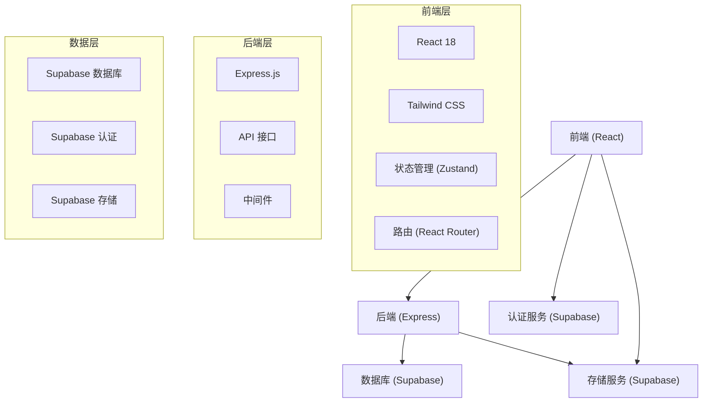
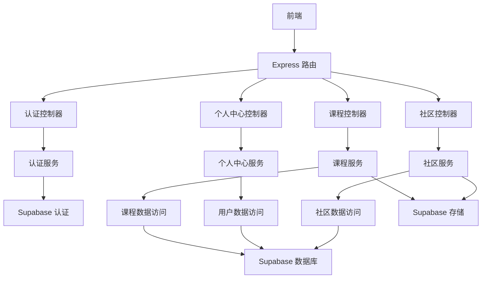
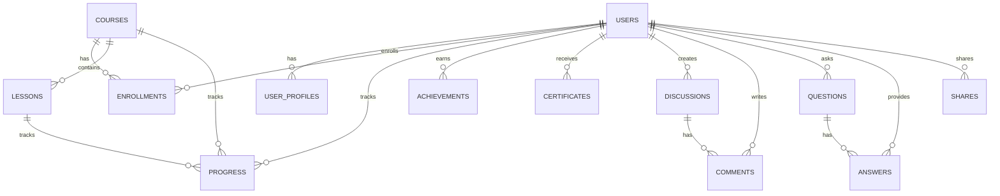

## 1. Architecture Design



## 2. Technology Description
- 前端：React@18 + TypeScript + Tailwind CSS@3 + Vite
- 初始化工具：vite-init
- 后端：Express@4 + TypeScript
- 数据库：Supabase (PostgreSQL)
- 认证：Supabase Auth
- 存储：Supabase Storage
- 状态管理：Zustand
- 路由：React Router DOM
- 图标：Lucide React
- 图表：Chart.js

## 3. Route Definitions
| 路由 | 用途 |
|-------|---------|
| / | 首页 |
| /courses | 课程列表页 |
| /courses/:id | 课程详情页 |
| /courses/:id/lessons/:lessonId | 课程章节内容页 |
| /profile | 个人中心 |
| /community | 社区页 |
| /community/discussions | 讨论区 |
| /community/questions | 问答板块 |
| /community/shares | 用户分享 |
| /login | 登录页 |
| /register | 注册页 |
| /forgot-password | 密码找回页 |

## 4. API Definitions

### 4.1 认证相关 API
| 端点 | 方法 | 功能 | 请求体 | 响应 |
|-------|------|---------|---------|---------|
| /api/auth/register | POST | 用户注册 | `{ email, password, name }` | `{ user, token }` |
| /api/auth/login | POST | 用户登录 | `{ email, password }` | `{ user, token }` |
| /api/auth/logout | POST | 用户登出 | N/A | `{ success: true }` |
| /api/auth/reset-password | POST | 重置密码 | `{ email }` | `{ success: true }` |

### 4.2 课程相关 API
| 端点 | 方法 | 功能 | 请求体 | 响应 |
|-------|------|---------|---------|---------|
| /api/courses | GET | 获取课程列表 | N/A | `{ courses: Course[] }` |
| /api/courses/:id | GET | 获取课程详情 | N/A | `Course` |
| /api/courses/:id/lessons | GET | 获取课程章节 | N/A | `{ lessons: Lesson[] }` |
| /api/courses/:id/lessons/:lessonId | GET | 获取章节内容 | N/A | `Lesson` |
| /api/courses/:id/progress | GET | 获取学习进度 | N/A | `{ progress: number }` |
| /api/courses/:id/progress | PUT | 更新学习进度 | `{ lessonId, completed: boolean }` | `{ progress: number }` |

### 4.3 个人中心相关 API
| 端点 | 方法 | 功能 | 请求体 | 响应 |
|-------|------|---------|---------|---------|
| /api/profile | GET | 获取用户资料 | N/A | `UserProfile` |
| /api/profile | PUT | 更新用户资料 | `{ name, avatar, preferences }` | `UserProfile` |
| /api/profile/achievements | GET | 获取用户成就 | N/A | `{ achievements: Achievement[] }` |
| /api/profile/certificates | GET | 获取用户证书 | N/A | `{ certificates: Certificate[] }` |
| /api/profile/recommendations | GET | 获取个性化推荐 | N/A | `{ courses: Course[] }` |

### 4.4 社区相关 API
| 端点 | 方法 | 功能 | 请求体 | 响应 |
|-------|------|---------|---------|---------|
| /api/community/discussions | GET | 获取讨论列表 | N/A | `{ discussions: Discussion[] }` |
| /api/community/discussions | POST | 创建讨论 | `{ title, content, category }` | `Discussion` |
| /api/community/discussions/:id | GET | 获取讨论详情 | N/A | `Discussion` |
| /api/community/discussions/:id/comments | POST | 添加评论 | `{ content }` | `Comment` |
| /api/community/questions | GET | 获取问题列表 | N/A | `{ questions: Question[] }` |
| /api/community/questions | POST | 创建问题 | `{ title, content, tags }` | `Question` |
| /api/community/questions/:id | GET | 获取问题详情 | N/A | `Question` |
| /api/community/questions/:id/answers | POST | 添加回答 | `{ content }` | `Answer` |
| /api/community/shares | GET | 获取分享列表 | N/A | `{ shares: Share[] }` |
| /api/community/shares | POST | 创建分享 | `{ title, content, media }` | `Share` |

## 5. Server Architecture Diagram



## 6. Data Model

### 6.1 Data Model Definition



### 6.2 Data Definition Language

#### 用户相关表
```sql
-- 用户表 (由 Supabase Auth 自动创建)
-- 注意：Supabase Auth 会自动管理用户认证，我们只需要创建关联的用户资料表

-- 用户资料表
CREATE TABLE user_profiles (
    id UUID REFERENCES auth.users(id) PRIMARY KEY,
    name VARCHAR(255) NOT NULL,
    avatar_url VARCHAR(255),
    bio TEXT,
    learning_goals TEXT,
    skill_level VARCHAR(50),
    preferences JSONB DEFAULT '{}',
    created_at TIMESTAMP WITH TIME ZONE DEFAULT NOW(),
    updated_at TIMESTAMP WITH TIME ZONE DEFAULT NOW()
);

-- 成就表
CREATE TABLE achievements (
    id SERIAL PRIMARY KEY,
    user_id UUID REFERENCES auth.users(id),
    type VARCHAR(100) NOT NULL,
    name VARCHAR(255) NOT NULL,
    description TEXT,
    badge_url VARCHAR(255),
    unlocked_at TIMESTAMP WITH TIME ZONE DEFAULT NOW()
);

-- 证书表
CREATE TABLE certificates (
    id SERIAL PRIMARY KEY,
    user_id UUID REFERENCES auth.users(id),
    course_id INTEGER NOT NULL,
    certificate_url VARCHAR(255) NOT NULL,
    issued_at TIMESTAMP WITH TIME ZONE DEFAULT NOW()
);
```

#### 课程相关表
```sql
-- 课程表
CREATE TABLE courses (
    id SERIAL PRIMARY KEY,
    title VARCHAR(255) NOT NULL,
    description TEXT NOT NULL,
    level VARCHAR(50) NOT NULL,
    category VARCHAR(100) NOT NULL,
    cover_image_url VARCHAR(255),
    price DECIMAL(10,2) DEFAULT 0,
    is_premium BOOLEAN DEFAULT FALSE,
    duration INTEGER, -- 课程总时长（分钟）
    rating DECIMAL(3,2) DEFAULT 0,
    enroll_count INTEGER DEFAULT 0,
    created_at TIMESTAMP WITH TIME ZONE DEFAULT NOW(),
    updated_at TIMESTAMP WITH TIME ZONE DEFAULT NOW()
);

-- 章节表
CREATE TABLE lessons (
    id SERIAL PRIMARY KEY,
    course_id INTEGER REFERENCES courses(id),
    title VARCHAR(255) NOT NULL,
    description TEXT,
    content_type VARCHAR(50) NOT NULL, -- video, text, interactive
    content_url VARCHAR(255),
    duration INTEGER, -- 章节时长（分钟）
    order_index INTEGER NOT NULL,
    created_at TIMESTAMP WITH TIME ZONE DEFAULT NOW()
);

-- 报名记录表
CREATE TABLE enrollments (
    id SERIAL PRIMARY KEY,
    user_id UUID REFERENCES auth.users(id),
    course_id INTEGER REFERENCES courses(id),
    enrolled_at TIMESTAMP WITH TIME ZONE DEFAULT NOW(),
    UNIQUE(user_id, course_id)
);

-- 学习进度表
CREATE TABLE progress (
    id SERIAL PRIMARY KEY,
    user_id UUID REFERENCES auth.users(id),
    course_id INTEGER REFERENCES courses(id),
    lesson_id INTEGER REFERENCES lessons(id),
    completed BOOLEAN DEFAULT FALSE,
    last_accessed TIMESTAMP WITH TIME ZONE DEFAULT NOW(),
    UNIQUE(user_id, lesson_id)
);
```

#### 社区相关表
```sql
-- 讨论表
CREATE TABLE discussions (
    id SERIAL PRIMARY KEY,
    user_id UUID REFERENCES auth.users(id),
    title VARCHAR(255) NOT NULL,
    content TEXT NOT NULL,
    category VARCHAR(100),
    view_count INTEGER DEFAULT 0,
    comment_count INTEGER DEFAULT 0,
    created_at TIMESTAMP WITH TIME ZONE DEFAULT NOW(),
    updated_at TIMESTAMP WITH TIME ZONE DEFAULT NOW()
);

-- 评论表
CREATE TABLE comments (
    id SERIAL PRIMARY KEY,
    user_id UUID REFERENCES auth.users(id),
    discussion_id INTEGER REFERENCES discussions(id),
    content TEXT NOT NULL,
    created_at TIMESTAMP WITH TIME ZONE DEFAULT NOW()
);

-- 问题表
CREATE TABLE questions (
    id SERIAL PRIMARY KEY,
    user_id UUID REFERENCES auth.users(id),
    title VARCHAR(255) NOT NULL,
    content TEXT NOT NULL,
    tags TEXT[],
    view_count INTEGER DEFAULT 0,
    answer_count INTEGER DEFAULT 0,
    is_solved BOOLEAN DEFAULT FALSE,
    created_at TIMESTAMP WITH TIME ZONE DEFAULT NOW(),
    updated_at TIMESTAMP WITH TIME ZONE DEFAULT NOW()
);

-- 回答表
CREATE TABLE answers (
    id SERIAL PRIMARY KEY,
    user_id UUID REFERENCES auth.users(id),
    question_id INTEGER REFERENCES questions(id),
    content TEXT NOT NULL,
    is_accepted BOOLEAN DEFAULT FALSE,
    created_at TIMESTAMP WITH TIME ZONE DEFAULT NOW()
);

-- 分享表
CREATE TABLE shares (
    id SERIAL PRIMARY KEY,
    user_id UUID REFERENCES auth.users(id),
    title VARCHAR(255) NOT NULL,
    content TEXT NOT NULL,
    media_url VARCHAR(255),
    media_type VARCHAR(50),
    like_count INTEGER DEFAULT 0,
    comment_count INTEGER DEFAULT 0,
    created_at TIMESTAMP WITH TIME ZONE DEFAULT NOW()
);
```

#### 权限设置
```sql
-- 为匿名用户授予基本读取权限
GRANT SELECT ON courses, lessons, discussions, questions, shares TO anon;

-- 为认证用户授予全部权限
GRANT ALL PRIVILEGES ON user_profiles, achievements, certificates, enrollments, progress, discussions, comments, questions, answers, shares TO authenticated;
GRANT SELECT ON courses, lessons TO authenticated;

-- 为课程表创建索引
CREATE INDEX idx_courses_level ON courses(level);
CREATE INDEX idx_courses_category ON courses(category);

-- 为进度表创建索引
CREATE INDEX idx_progress_user_course ON progress(user_id, course_id);

-- 为社区表创建索引
CREATE INDEX idx_discussions_category ON discussions(category);
CREATE INDEX idx_questions_tags ON questions USING GIN (tags);
```

#### 初始数据
```sql
-- 插入示例课程数据
INSERT INTO courses (title, description, level, category, cover_image_url, price, is_premium, duration, rating, enroll_count)
VALUES
('商务数据分析基础', '掌握数据分析的基本概念和方法，包括数据收集、清洗、分析和可视化', '初级', '数据分析', 'https://example.com/course1.jpg', 0, FALSE, 360, 4.8, 1200),
('SQL 数据分析实战', '学习使用 SQL 进行数据查询、分析和处理，掌握高级 SQL 技巧', '中级', '数据库', 'https://example.com/course2.jpg', 99, TRUE, 480, 4.9, 850),
('Python 数据科学入门', '使用 Python 进行数据科学和机器学习，包括 NumPy、Pandas 和 Matplotlib', '中级', '编程', 'https://example.com/course3.jpg', 149, TRUE, 600, 4.7, 620),
('商业智能与数据可视化', '学习使用 Tableau 和 Power BI 创建交互式数据可视化和仪表板', '高级', '数据可视化', 'https://example.com/course4.jpg', 199, TRUE, 540, 4.6, 480),
('大数据分析与处理', '掌握 Hadoop、Spark 等大数据技术，处理和分析大规模数据集', '高级', '大数据', 'https://example.com/course5.jpg', 249, TRUE, 720, 4.5, 320);

-- 为第一门课程插入章节数据
INSERT INTO lessons (course_id, title, description, content_type, content_url, duration, order_index)
VALUES
(1, '数据分析简介', '了解数据分析的基本概念、流程和应用场景', 'video', 'https://example.com/lesson1.mp4', 45, 1),
(1, '数据收集与清洗', '学习如何收集和清洗数据，确保数据质量', 'video', 'https://example.com/lesson2.mp4', 60, 2),
(1, '数据可视化基础', '使用 Excel 和 Google Sheets 创建基本的数据可视化', 'interactive', 'https://example.com/lesson3.html', 45, 3),
(1, '数据分析方法', '学习描述性分析、预测性分析和规范性分析方法', 'video', 'https://example.com/lesson4.mp4', 60, 4),
(1, '案例分析', '通过实际商业案例学习如何应用数据分析解决问题', 'text', 'https://example.com/lesson5.html', 45, 5),
(1, '实战练习', '完成一个完整的数据分析项目，从数据收集到结果展示', 'interactive', 'https://example.com/lesson6.html', 60, 6);
```